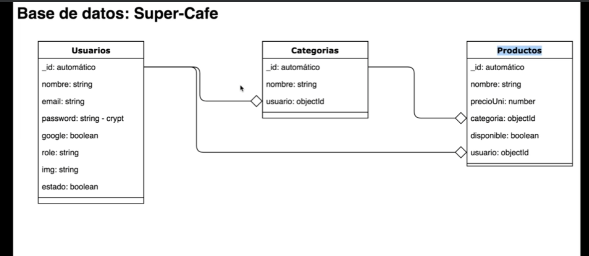

# WebServer + RestServer



Recuerden que deben de ejecutar ```npm install``` para reconstruir los módulos de Node.


db.createCollection('roles')
db.roles.insertOne({"rol":"ADMIN_ROLE"})
db.roles.insertOne({"rol":"USER_ROLE"})